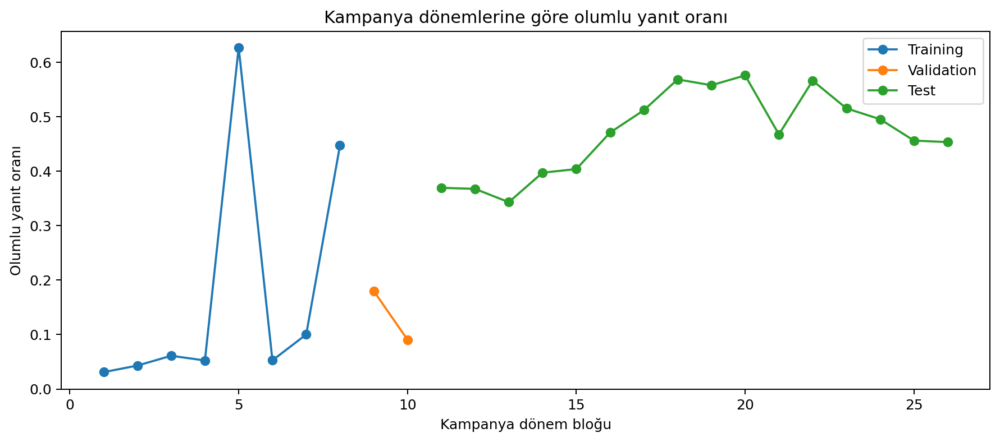
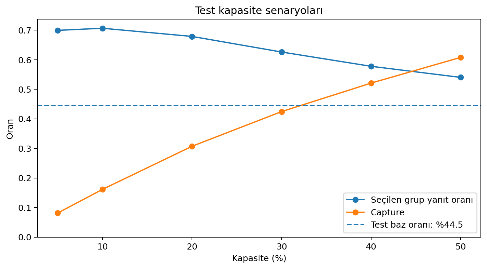
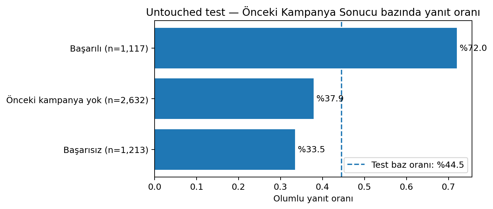

# Bank Marketing: Kronolojik Yanıt Tahmini, Temas Önceliklendirmesi ve Segment Profili

Bu proje, UCI Bank Marketing veri setindeki kampanya temas kayıtlarını olumlu yanıt eğilimine göre **dönem içinde sıralamak**, sınırlı temas kapasitesini değerlendirmek ve önceliklendirilen kayıtların profilini Power BI kullanımına uygun tablolarla açıklamak amacıyla hazırlanmış bir eğitim ve portföy çalışmasıdır.

> **Güncel sürüm:** v4  
> **Ana analiz:** `notebooks/bank_marketing_chronological_analysis_v4.ipynb`  
> **Çalıştırılabilir Python dosyası:** `src/bank_marketing_chronological_analysis_v4.py`

## İş sorusu

Her kampanya döneminde yalnızca belirli sayıda temas kaydı işleme alınabilecekse, hangi kayıtlar önce değerlendirilmelidir ve önceliklendirilen kayıtların profili nasıldır?

Modelin `response_score` çıktısı kesin satın alma olasılığı değildir. Kayıtları aynı kampanya dönemi içinde sıralamak için kullanılan göreli bir **yanıt eğilimi / öncelik skorudur**.

## Projenin kapsamı

1. Veri kalitesi, `unknown` değerleri ve tam duplicate satırlar kontrol edildi.
2. Dosyanın kronolojik sırası korunarak tam kampanya dönem blokları oluşturuldu.
3. Dönemler training, validation ve untouched test olarak ayrıldı.
4. `duration` veri sızıntısı nedeniyle modelden çıkarıldı.
5. Makroekonomik alanlar dönem vekili olma ve taşınabilirlik riski nedeniyle ana modelden çıkarıldı.
6. Logistic Regression ve Random Forest karşılaştırıldı.
7. Model seçimi validation bölümündeki **Lift@20** sonucuna göre yapıldı; PR-AUC destek metriği olarak kullanıldı.
8. Seçilen model training ve validation birleştirilerek yeniden eğitildi ve en güncel test bölümünde yalnızca bir kez değerlendirildi.
9. Test kayıtları her kampanya döneminde ayrı sıralanarak %5–%50 kapasite senaryoları üretildi.
10. Untouched test bölümünde meslek, kanal, önceki kampanya, temas sayısı, yaş ve eğitim profilleri raporlandı.
11. Power BI için kayıt düzeyi, model, kapasite, dönem ve segment tabloları oluşturuldu.

## Kronolojik ayrım

| Bölüm | Dönem blokları | Kayıt | Olumlu yanıt oranı |
|---|---:|---:|---:|
| Training | 1–8 | 27.964 | %5,24 |
| Validation | 9–10 | 8.250 | %11,71 |
| Test | 11–26 | 4.962 | %44,50 |

Dönemler arasındaki baz oran değişimi belirgindir. Bu nedenle sonuçlar gelecekteki kampanyalar için performans garantisi olarak yorumlanmaz.



## Validation model karşılaştırması

| Model | ROC-AUC | PR-AUC | Lift@20 | Capture@20 |
|---|---:|---:|---:|---:|
| Random Forest | 0,634 | **0,199** | **1,42** | **%28,36** |
| Logistic Regression | **0,640** | 0,195 | 1,37 | %27,33 |

Birincil seçim ölçütü Lift@20 olduğu için Random Forest seçildi. İki model arasında kesin ve büyük bir üstünlük iddia edilmez.

## Untouched test sonucu

| Metrik | Sonuç |
|---|---:|
| Seçilen model | Random Forest |
| ROC-AUC | 0,660 |
| PR-AUC | 0,609 |
| F1 | 0,621 |
| Test baz oranı | %44,50 |
| Dönem içi Top %20 seçilen kayıt | 999 |
| Top %20 yanıt oranı | %67,87 |
| Capture@20 | %30,71 |
| Lift@20 | 1,53 |
| Dönem bazlı rastgele seçim beklentisine göre fark | yaklaşık +233 olumlu kayıt |

“Beklenen fark” kontrollü deney, gerçek kampanya artışı veya uplift sonucu değildir. Her test dönemi için aynı kapasitede rastgele seçim beklentisiyle yapılan retrospektif karşılaştırmadır.



## Segment profili

V4 sürümünde untouched test kayıtları aşağıdaki boyutlarda ayrıca incelenir:

- Meslek
- Temas kanalı
- Önceki kampanya sonucu
- Kampanya içindeki temas sayısı
- Yaş bandı
- Eğitim

Her segment için kayıt hacmi, olumlu kayıt sayısı, yanıt oranı, genel ortalamaya göre lift ve düşük örneklem uyarısı üretilir. Bulgular gözlemseldir; neden–sonuç ilişkisi veya otomatik erişim/dışlama politikası olarak yorumlanmaz.



## Kullanılan özellikler

### Müşteri profili

`age`, `job`, `marital`, `education`, `default`, `housing`, `loan`

### Geçmiş kampanya bilgileri

`previous`, `poutcome`, `previously_contacted`

### Planlandığı varsayılan temas bağlamı

`campaign`, `contact`, `month`, `day_of_week`

Ayrıntılı alan politikası: [`docs/model_feature_policy.csv`](docs/model_feature_policy.csv)

## Power BI kullanımı

Ana dinamik tablo:

```text
outputs/powerbi/powerbi_scored_test.csv
```

Bu tablo kayıt düzeyinde skor, gerçek yanıt, dönem içi sıra, öncelik bandı ve Türkçeleştirilmiş profil alanlarını içerir. Diğer CSV dosyaları KPI, kapasite, model karşılaştırması, özellik önemi ve segment özetleri için yardımcı tablolardır.

- Tablo sözlüğü: [`docs/powerbi_tables.md`](docs/powerbi_tables.md)
- Üç sayfalık dashboard rehberi: [`docs/powerbi_dashboard_guide.md`](docs/powerbi_dashboard_guide.md)
- PBIX alanı ve kullanım notu: [`powerbi/README.md`](powerbi/README.md)

## Proje yapısı

```text
bank-marketing-response-prioritization/
├── README.md
├── CHANGELOG.md
├── requirements.txt
├── src/
│   └── bank_marketing_chronological_analysis_v4.py
├── notebooks/
│   └── bank_marketing_chronological_analysis_v4.ipynb
├── data/
│   └── bank-additional-full.csv
├── docs/
│   ├── methodology.md
│   ├── model_feature_policy.csv
│   ├── powerbi_dashboard_guide.md
│   └── powerbi_tables.md
├── outputs/
│   ├── figures/
│   ├── metrics/
│   └── powerbi/
├── powerbi/
│   └── README.md
└── archive/
    └── v3/
        ├── README.md
        └── bank_marketing_chronological_analysis_v3.ipynb
```

## Kurulum ve çalıştırma

Proje Python **3.13.5** ile test edilmiştir.

```bash
python -m venv .venv
```

Windows:

```bash
.venv\Scripts\activate
pip install -r requirements.txt
jupyter notebook notebooks/bank_marketing_chronological_analysis_v4.ipynb
```

macOS / Linux:

```bash
source .venv/bin/activate
pip install -r requirements.txt
jupyter notebook notebooks/bank_marketing_chronological_analysis_v4.ipynb
```

Python dosyasını doğrudan çalıştırmak için proje kökünde:

```bash
python src/bank_marketing_chronological_analysis_v4.py
```

Notebook veya Python dosyası baştan sona çalıştırıldığında `outputs/metrics/`, `outputs/powerbi/` ve `outputs/figures/` klasörleri yeniden üretilir.

## Başlıca sınırlılıklar

- Benzersiz müşteri kimliği ve eksiksiz tarih/yıl bilgisi bulunmamaktadır.
- Validation yalnızca iki tam kampanya dönem bloğu içerir.
- Training, validation ve test baz oranları belirgin biçimde farklıdır.
- `campaign`, `contact`, `month` ve `day_of_week` alanlarının skorlama anında bilindiği varsayılmıştır.
- Model skoru kalibre edilmiş kesin satın alma olasılığı değildir.
- Top %20 gerçek çağrı merkezi kapasitesi veya maliyet/getiri optimumu değildir.
- Maliyet, ürün getirisi ve kontrol grubu olmadığı için ROI veya gerçek uplift hesaplanmamıştır.
- Permutation importance ve segment farkları nedensellik göstermez.
- Kayıt sayısı 30’un altında olan segmentler düşük örneklem olarak işaretlenmiştir.
- Yaş ve benzeri profil alanları otomatik dışlama veya erişim kısıtlama kuralı olarak kullanılmamalıdır.

## Veri kaynağı

UCI Machine Learning Repository — **Bank Marketing**, Dataset ID 222  
DOI: `10.24432/C5K306`

Bu repo kamuya açık eğitim verisi üzerinde hazırlanmış retrospektif bir portföy analizidir. Kod lisansı bilinçli olarak eklenmemiştir; repository sahibi paylaşım koşullarına göre ayrıca lisans seçmelidir.
